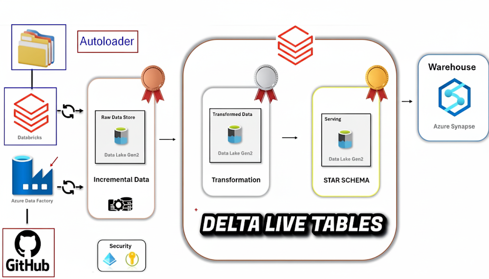
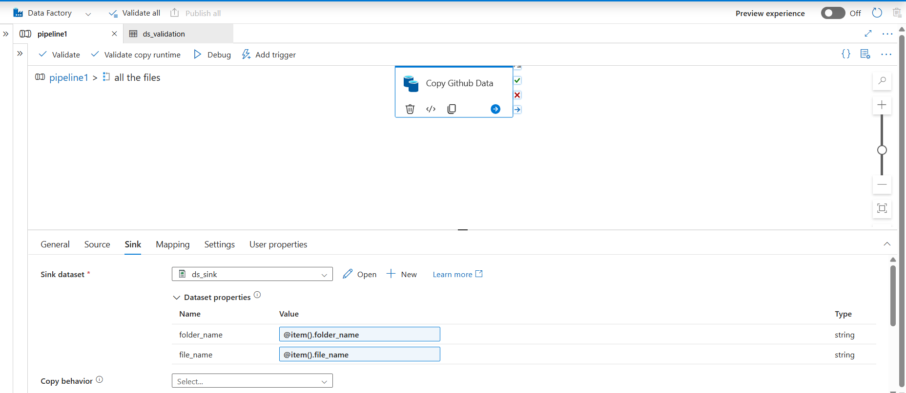
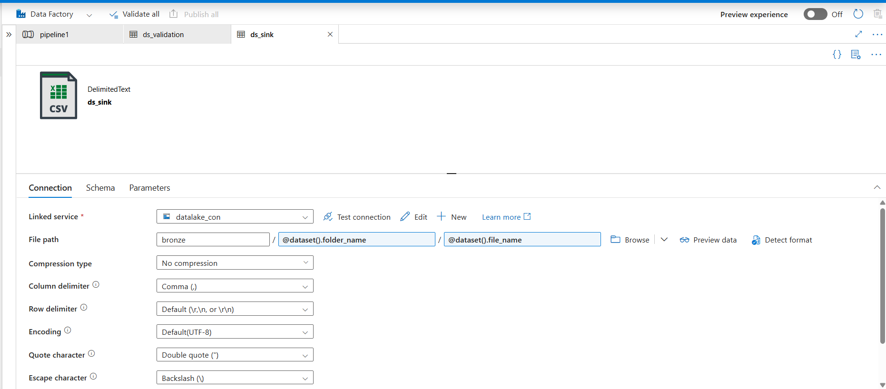
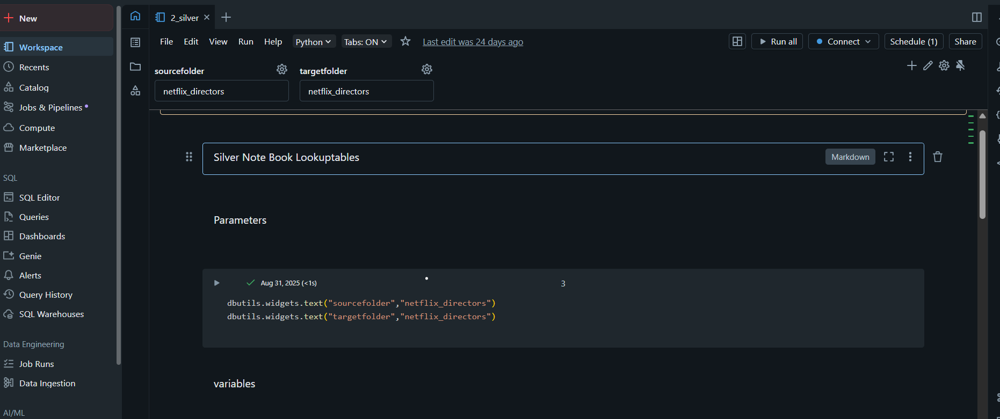
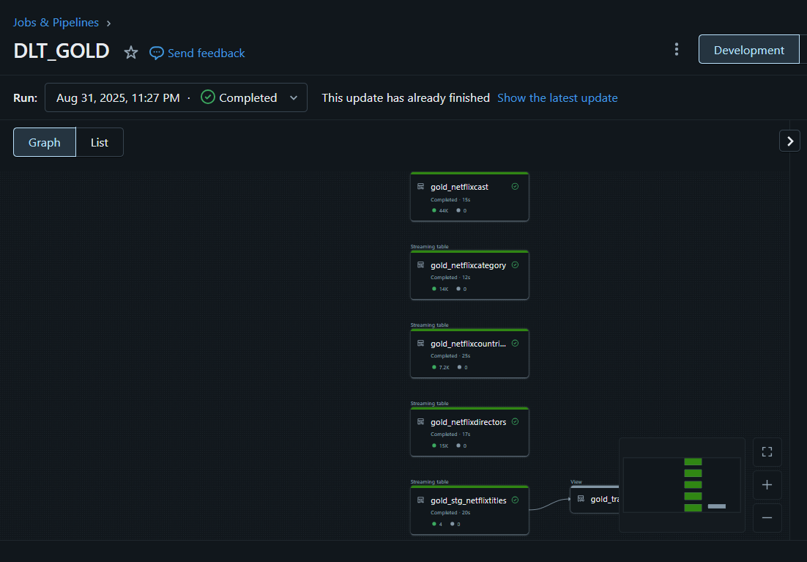

<h1 align="center"> 🎬 Netflix End-to-End Data Engineering Project – Medallion Architecture</h1>

<h5 align="center">This repository demonstrates an end-to-end <b>data engineering pipeline</b> on Azure using the <b>Medallion Architecture</b> (Bronze → Silver → Gold) with Netflix data.</h5>

---

<h2 align="center">🏗️ Architecture</h2>

  

**Flow:**
1. Data ingestion with **Azure Data Factory** into **ADLS Gen2** (Bronze).
2. Transformation & cleaning with **Databricks (PySpark, Delta Lake)** (Silver).
3. Business aggregation & fact/dimension modeling with **Delta Live Tables** (Gold).

---

## ⚙️ Services & Tools
- Azure Data Factory (ADF)
- Azure Data Lake Storage Gen2
- Azure Databricks (PySpark, Auto Loader, Delta Lake, Delta Live Tables)
- Unity Catalog (secure access control)

---

<h2 align="center">🏗️ Architecture with Flow</h2>

  

---

## 📂 Repository Contents
- **/adf-pipeline**: JSON exports of ADF pipelines & datasets.
- **/db-workspace**: Databricks notebooks (ETL, DLT pipelines).
- **/netflix-datasets**: Source CSV files from GitHub.
- **/python-scripts**: PySpark scripts for transformations.
- **/screenshots**: Pipeline runs, Databricks jobs, SQL outputs, dashboards.
- **/architecture**: Architecture diagrams.

---

## ⚙️ Project Workflow (Detailed Steps)

The project follows the **Medallion Architecture**: **Bronze → Silver → Gold**.

---

### 🥉 Step 1: Bronze Layer – Raw Data Ingestion
- Source: Raw Netflix dataset (CSV) from **GitHub**.
- Ingestion via **ADF ForEach pipeline** (dynamic file/folder handling).
- Data stored as-is in **ADLS Gen2 Bronze container**.
- Purpose: Immutable copy of source data for **auditing & replay**.

<h3 align="center">Source Pipeline</h3>

  

  

<h3 align="center">Sink Pipeline</h3>

  

  

---

### 🥈 Step 2: Silver Layer – Data Cleaning & Transformation
- Processing in **Databricks (PySpark)** with **Auto Loader**.
- Transformations include:
  - Handling missing/null values
  - Schema standardization
  - Data validation & cleaning
- Stored in **ADLS Silver container** as **Delta Lake tables**.

<h3 align="center">Post Transformation Data in Silver Layer</h3>

  

  

---

### 🥇 Step 3: Gold Layer – Business Aggregation
- Business logic applied in **Databricks (Delta Live Tables)**.
- Joins, aggregations, and fact/dimension table creation.
- Data written to **Azure Synapse SQL Pools** for reporting.

<h3 align="center">Writing to Gold Layer</h3>

  

  

---

### 🔄 Step 4: Orchestration & Compute
- **ADF** orchestrates pipelines (schedules, triggers, ingestion).
- **Databricks** performs:
  - Bronze → Silver transformations
  - Silver → Gold aggregations (DLT pipelines, business rules)

<h3 align="center">Data Model Pipeline</h3>

  

  

---

## 📚 Key Learnings from the Project
Working on this end-to-end Netflix project provided hands-on exposure to **real-world Azure Data Engineering**.

### 🔹 1. Azure Data Factory (ADF)
- Built parameterized **ForEach pipelines** for dynamic ingestion.
- Learned monitoring & debugging of pipelines.

### 🔹 2. ADLS Gen2
- Designed **layered data lake (Bronze, Silver, Gold)**.
- Understood immutability in Bronze and schema enforcement in Silver.

### 🔹 3. Databricks (PySpark, Delta, Auto Loader, DLT)
- Implemented incremental ingestion with **Auto Loader**.
- Built business-ready fact/dim tables with **Delta Live Tables**.
- Applied transformations (null handling, schema evolution, deduplication).

### 🔹 4. Delta Lake
- Hands-on with ACID compliance, schema evolution & versioning.

---

## 📈 Expected Outcomes
- ✅ Organized & production-ready Netflix data pipeline.
- ✅ Faster query performance via Delta Lake & Synapse.

---

## 🏗️ Setup & Deployment
1. Clone repo & Netflix dataset from GitHub.
2. Create ADLS containers: **raw, bronze, silver, gold**.
3. Configure ADF pipelines for ingestion.
4. Develop Databricks notebooks for ETL & DLT.
5. Enable **Unity Catalog** for secure ADLS access.

---

## 👤 Author
Project implemented by **Mansi Matekar**
